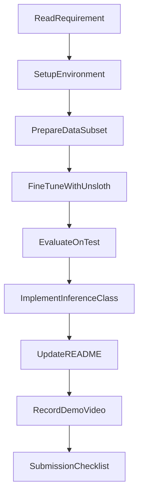

# Plan Thực Hiện Lab (Bám Theo requirement.md)

## 1. Mục tiêu kế hoạch (Kaggle-first)

Hoàn thành end-to-end bài lab phân loại intent ngân hàng với `BANKING77` và `Unsloth` theo luồng **train trên Kaggle, inference trên máy local**, bảo đảm:

- Đúng yêu cầu kỹ thuật của đề,
- Có kết quả đánh giá trên test set,
- Có inference class đúng interface chấm bài,
- Có tài liệu và video demo sẵn sàng để nộp.

## 2. Phạm vi đầu ra

Kế hoạch này hướng tới việc hoàn thiện các thành phần:

- Dữ liệu đã xử lý: `sample_data/train.csv`, `sample_data/test.csv`
- Model checkpoint sau fine-tuning: thư mục `outputs/`
- Inference chạy được qua class `IntentClassification`
- Báo cáo mô tả và hướng dẫn trong `README.md`
- Video demo và link public trong README
- Notebook Kaggle chạy train thành công và có output tải về được

## 2.1 Model được chọn

Model khuyến nghị để làm bài lab trên Kaggle:

- `unsloth/Llama-3.2-1B-Instruct-bnb-4bit`

Lý do chọn:

- Phù hợp GPU T4 trên Kaggle (tiết kiệm VRAM nhờ 4-bit).
- Ổn định với pipeline Unsloth/LoRA hiện có trong project.
- Dễ giữ đúng yêu cầu đề bài về inference class và reproducibility.

Fallback khi gặp OOM hoặc quota yếu:

- Giảm `per_device_train_batch_size` trước, chưa cần đổi model.
- Chỉ cân nhắc model nhỏ hơn khi đã thử giảm batch/seq length mà vẫn lỗi.

## 3. Luồng triển khai tổng quát

## 4. Kế hoạch chi tiết theo giai đoạn

### Giai đoạn 1: Chuẩn bị môi trường Kaggle + local

**Mục tiêu**
- Bảo đảm môi trường chạy được preprocess/train/inference.

**Việc cần làm**
- Kaggle:
  - Tạo notebook mới, bật GPU (T4).
  - Cài dependencies cần cho Unsloth trong notebook.
  - Bật internet trong notebook để tải model/dataset.
- Local:
  - Cài dependencies từ `requirements.txt` để chạy inference sau khi tải checkpoint về.
- Xác nhận model dùng cho train là `unsloth/Llama-3.2-1B-Instruct-bnb-4bit`.

**Kết quả cần đạt**
- Chạy được Python env và import các thư viện chính.

### Giai đoạn 2: Chuẩn bị dữ liệu trên Kaggle

**Mục tiêu**
- Tạo subset hợp lệ từ `BANKING77`, có train/test rõ ràng.

**Việc cần làm**
- Chạy `scripts/preprocess_data.py`.
- Xác nhận dữ liệu đã:
  - được chuẩn hóa text,
  - map label đúng,
  - lấy mẫu subset cân bằng theo lớp (nếu áp dụng).
- Kiểm tra tồn tại 2 file:
  - `sample_data/train.csv`
  - `sample_data/test.csv`

**Kết quả cần đạt**
- Có dữ liệu đầu vào sạch, đúng format cho training.

### Giai đoạn 3: Fine-tuning với Unsloth trên Kaggle

**Mục tiêu**
- Huấn luyện model theo cấu hình rõ ràng và lưu checkpoint.

**Việc cần làm**
- Rà soát `configs/train.yaml` (batch size, LR, optimizer, epoch/steps, max length, regularization).
- Chạy:
  - `python scripts/train.py` hoặc `bash train.sh`.
- Theo dõi log train/loss.
- Lưu checkpoint vào `outputs/`.

**Kết quả cần đạt**
- Training chạy hoàn chỉnh và có checkpoint sử dụng được.
- Có file nén để tải về local (ví dụ `outputs.zip`).

### Giai đoạn 4: Đánh giá mô hình

**Mục tiêu**
- Có chỉ số chất lượng trên tập test độc lập.

**Việc cần làm**
- Đánh giá model trên `sample_data/test.csv`.
- Ghi nhận ít nhất accuracy cuối cùng.
- Nếu có thêm precision/recall/F1 thì ghi vào báo cáo.

**Kết quả cần đạt**
- Có metric rõ ràng để đưa vào README và video.

### Giai đoạn 5: Tải checkpoint về local và triển khai inference chuẩn đề

**Mục tiêu**
- Cung cấp file inference độc lập đúng interface bắt buộc.

**Việc cần làm**
- Trên Kaggle, nén output checkpoint và tải về máy local.
- Giải nén checkpoint vào đúng thư mục project local.
- Xác nhận class trong `scripts/inference.py` có:
  - `__init__(self, model_path)`
  - `__call__(self, message)`
- Đảm bảo `model_path` đọc được config chứa đường dẫn checkpoint.
- Test dự đoán với ít nhất 1 input đơn.

**Kết quả cần đạt**
- Chạy được dự đoán nhãn intent đầu cuối từ checkpoint đã train.

### Giai đoạn 6: Hoàn thiện tài liệu và video demo

**Mục tiêu**
- Đủ điều kiện nộp theo rubric.

**Việc cần làm**
- Cập nhật `README.md`:
  - setup,
  - workflow Kaggle -> local,
  - cách chạy preprocess/train/inference,
  - thông số train chính,
  - accuracy test.
- Quay video 2-5 phút thể hiện:
  - chạy inference script,
  - input mẫu,
  - output predicted label,
  - accuracy cuối.
- Upload video lên Google Drive và gắn link public vào README.

**Kết quả cần đạt**
- Bộ nộp hoàn chỉnh, người chấm có thể reproduce nhanh.

## 5. Timeline gợi ý (1-2 ngày)

- Buổi 1:
  - Setup Kaggle notebook + dependencies,
  - preprocess dữ liệu,
  - bắt đầu training trên Kaggle.
- Buổi 2:
  - hoàn tất training + evaluation và tải checkpoint về,
  - kiểm tra inference local,
  - cập nhật README và quay video.

## 6. Rủi ro và cách giảm rủi ro

- Hết GPU quota (Kaggle/Colab):
  - Đợi reset quota hoặc chuyển phiên khác, ưu tiên resume nếu có checkpoint.
- Out-of-memory:
  - Giảm `per_device_train_batch_size`, sau đó giảm `max_seq_length` nếu cần.
- Sai format inference:
  - Kiểm tra lại đúng hai method bắt buộc và đầu ra là `predicted_label`.
- Không tải được model/dataset trên Kaggle:
  - Kiểm tra Internet của notebook đã bật.
- Thiếu nội dung nộp:
  - Bám checklist ở Mục 8 trước khi submit.

## 7. Definition of Done

Chỉ xem là hoàn thành khi đồng thời đạt tất cả điều kiện:

- Có `sample_data/train.csv` và `sample_data/test.csv` hợp lệ.
- Có checkpoint model sau fine-tuning.
- Inference class chạy được cho input đơn và trả về nhãn intent.
- Có accuracy trên test set.
- README đầy đủ quy trình + link video demo public.
- Cấu trúc thư mục đúng format yêu cầu đề bài.

## 8. Checklist nộp bài

### 8.1 Checklist triển khai Kaggle -> local

- [ ] Tạo notebook Kaggle và bật GPU T4.
- [ ] Cài dependencies Unsloth trong notebook.
- [ ] Train với model `unsloth/Llama-3.2-1B-Instruct-bnb-4bit`.
- [ ] Có log train + metric test (accuracy).
- [ ] Nén output (`outputs.zip`) và tải về local.
- [ ] Giải nén checkpoint vào project local.
- [ ] Chạy inference local thành công với `configs/inference.yaml`.

### 8.2 Checklist nộp bài cuối

- [ ] Cấu trúc thư mục đúng chuẩn đề.
- [ ] `scripts/preprocess_data.py`, `scripts/train.py`, `scripts/inference.py` đầy đủ.
- [ ] `configs/train.yaml`, `configs/inference.yaml` đầy đủ.
- [ ] `sample_data/train.csv` và `sample_data/test.csv` có dữ liệu.
- [ ] Có checkpoint model sau train.
- [ ] `README.md` mô tả rõ workflow Kaggle -> local, cách chạy, kết quả.
- [ ] Có accuracy test set trong README.
- [ ] Video demo 2-5 phút, link public trong README.
